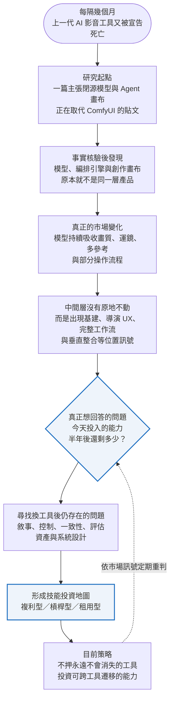
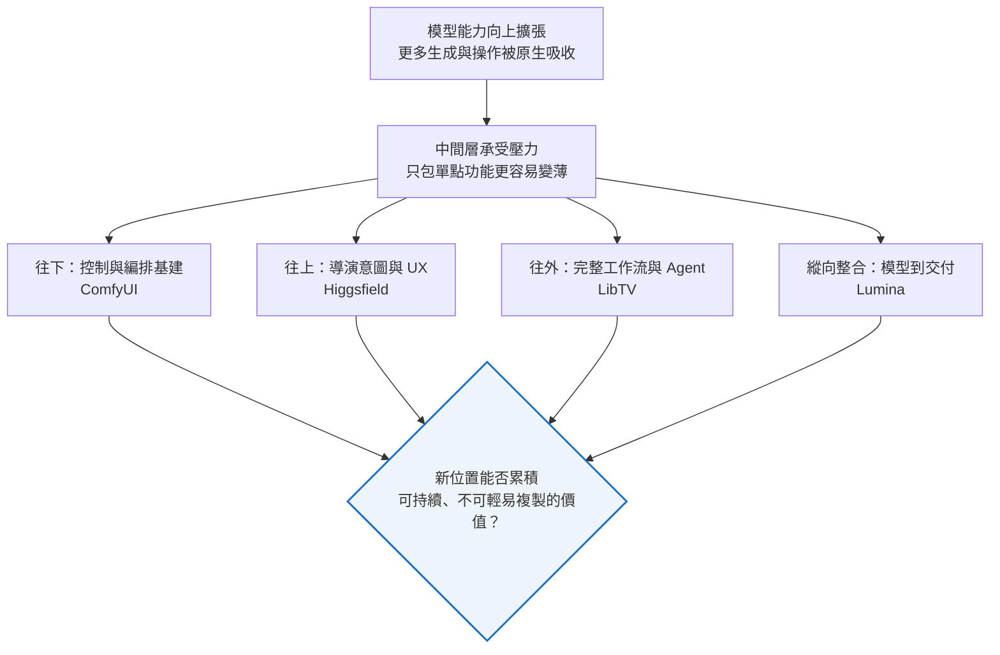
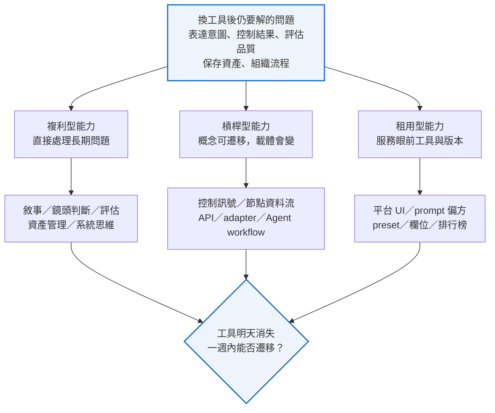

  
AI VIDEO LEARNING MAP · RESEARCH SNAPSHOT

  <h1>模型愈強，我該學什麼？</h1>
  
<strong>從 AI 影音「中間層」的遷移，尋找可累積、可遷移的能力</strong>

   
  

    每隔幾個月，上一代工具就會被宣告死亡。 
    真正昂貴的錯誤，不是押錯一家公司，而是把某個版本的操作熟練， 
    誤認成可以長期複利的專業能力。
  

  <h3>今天投入的能力，半年後還剩多少？</h3>
  

    <code>研究快照 2026-09-09</code>
    <code>v0.2</code>
    <code>市場觀察 × 學習假說</code>
  

  

    <a href="#30-秒回到研究現場"><strong>30 秒定位</strong></a>
    ·
    <a href="#三中間層的四種位置訊號"><strong>市場位置</strong></a>
    ·
    <a href="#五技能投資地圖"><strong>技能地圖</strong></a>
    ·
    <a href="#八哪些訊號會讓我改變判斷"><strong>改判訊號</strong></a>
    ·
    <a href="#九市場事實快照"><strong>事實快照</strong></a>
  

---

模型每隔幾個月就跨過一道原本需要人工、節點或外部工具才能完成的門檻。昨天值得專門學習的 prompt、運鏡 preset、節點組合，明天可能就成為模型的一個預設選項。

但另一個現象同時發生：AI 影音的「中間層」並沒有因此單純消失。ComfyUI、Higgsfield、LibTV、Lumina 等產品仍從不同位置擴張，而且彼此的切角愈來愈不一樣。

這篇文章不預測「哪個工具會贏」，而是追問一個更貼近個人學習投資的問題：

> **當模型不斷吸收原本屬於工具的能力，我現在該學什麼，才能短期做出成果，換工具後又不必歸零？**

<strong>閱讀前先知道：本文的證據邊界</strong>

本文的產品事實與判定沿用 2026-09-09 的原始研究，本次建立 repository 時沒有重新連網查核。原始材料列有來源名稱與日期，但沒有完整 URL bibliography；因此本文不宣稱已具備可一鍵回查的 citation ledger。

凡屬市場解讀或技能建議，會另外標為「本文推論」或「學習假說」。這是一份可定期回來重判的研究快照，不是工具排名，也不是未來預言。

## 30 秒回到研究現場

一句話摘要：

> **模型會持續吞掉單點功能；值得長期學習的，不是某個功能目前藏在哪個產品裡，而是功能被吸收後仍然存在的創作問題、判斷能力與控制方法。**

## 這篇文章怎麼讀

<table>
  <thead>
    <tr>
      <th align="left">你現在想回答什麼？</th>
      <th align="left">直接從這裡讀</th>
    </tr>
  </thead>
  <tbody>
    <tr>
      <td>我忘了當初為什麼研究這件事</td>
      <td><a href="#30-秒回到研究現場">30 秒回到研究現場</a> → <a href="#十目前結論">目前結論</a></td>
    </tr>
    <tr>
      <td>模型愈強，中間層為什麼還百花齊放？</td>
      <td><a href="#一模型愈強中間層為什麼反而愈多">市場問題本身</a></td>
    </tr>
    <tr>
      <td>這幾家公司其實在搶哪個位置？</td>
      <td><a href="#三中間層的四種位置訊號">四種位置訊號</a></td>
    </tr>
    <tr>
      <td>我現在到底該把時間投資在哪裡？</td>
      <td><a href="#五技能投資地圖">技能投資地圖</a></td>
    </tr>
    <tr>
      <td>隔幾個月回來，怎麼知道結論是否過期？</td>
      <td><a href="#八哪些訊號會讓我改變判斷">改判訊號</a> → <a href="#九市場事實快照">市場事實快照</a></td>
    </tr>
  </tbody>
</table>

---

## 一、模型愈強，中間層為什麼反而愈多？

乍看之下，模型能力提升應該會壓縮中間層：模型若能直接生成高畫質影片、處理多個參考素材、安排運鏡、產生聲音，原本負責這些工作的工具自然會變薄。

這個推論只對了一半。

模型提升確實會吃掉一批單點能力，但「從一句需求到可交付作品」之間仍存在許多問題：

- 使用者怎麼表達導演意圖？
- 多個模型如何選擇、組合與替換？
- 角色、場景與風格如何跨鏡頭維持一致？
- 一次生成如何變成可修改、可重跑的製作流程？
- 素材、版本、授權與生成紀錄如何管理？
- 團隊如何從概念走到分鏡、成片與交付？
- 結果好不好，由誰判斷，又如何穩定重現？

所以，中間層不是一個固定的產品類別。它更像「模型能力」與「可用成果」之間尚未被解決的摩擦集合。

當模型消除一種摩擦，中間層可能發生三件事：

1. 功能被模型原生吸收，產品變成薄 wrapper。
2. 產品往更高階的使用者問題移動。
3. 產品往更底層的控制、編排與基礎設施移動。

這也解釋了為什麼目前看見的廠商切角不同：它們未必在爭奪同一層，而是在搶占模型短期內仍未處理好的不同問題。

## 二、模型正在吃掉什麼？

依原始研究，Seedance 2.0／2.5 等模型已把多模態參考、原生音訊、多鏡頭與常見運鏡納入模型或平台能力。這能支持的結論是「模型與中間層的功能邊界正在重疊」，不能直接證明「完整中間層已被取代」。

目前折舊速度較快的，主要是：

- 更高的基礎畫質與更長的生成時間。
- 多圖、多影片、多音訊等參考輸入。
- 原生聲音、多鏡頭與常見運鏡。
- 固定風格、模板與部分剪輯操作。
- 由自然語言直接完成較長的操作鏈。

這不代表相關技能立刻失去用途，而是它們的「學習折舊率」正在提高。

例如，理解鏡頭推進為何有效，仍可能跨工具使用；熟記某平台的推進鏡頭 preset 名稱，則可能在一次改版後失效。理解 reference conditioning 解決什麼問題，仍能遷移；只會複製某版節點圖，遷移性就低得多。

真正該辨認的不是「這個功能還在不在」，而是：

> **我學到的是底層問題與控制原理，還是目前這個產品暫時要求我的操作方式？**

## 三、中間層的四種位置訊號

以下分類是本文的分析框架，不是廠商官方定位，也不是已證實的市場終局。四個案例的證據並不對稱：ComfyUI 與 Higgsfield 有較清楚的前後變化；LibTV 與 Lumina 主要顯示 2026 年當下的產品位置，還不足以證明它們已完成成功轉型。

### ComfyUI：從人操作的節點圖，往機器可執行的控制與編排移動

**可觀察事實｜原研究：已證實**

ComfyUI 已提供 API／Partner Nodes、Cloud 與可程式化 JSON graph；它也不必只在昂貴的本地 GPU 上運行。原研究引用 UpGuard 的公開實例調查，亦足以反駁「ComfyUI 只剩 NSFW 利基」的說法。

**本文推論**

當閉源模型把畫質、運鏡與多參考能力直接包進 prompt 介面後，「為了得到好畫面而手動堆大量節點」的吸引力可能下降；但 graph 也可能退到畫面背後，成為模型、LoRA、ControlNet、3D 訊號與後製步驟的編排層。

**學習假說**

值得學的不是更多節點名稱，而是工作流拆解、資料如何流動、控制訊號放在哪裡，以及如何讓流程可重跑。

**仍未知**

如果模型與平台原生提供同等程度的精細控制、版本鎖定和跨模型編排，graph 是否仍有足夠的必要性？現有產品動向不能直接證明長期留存與商業壁壘。

### Higgsfield：從單一模型競爭，往導演意圖與創作 UX 移動

**可觀察事實｜原研究：已證實**

Higgsfield 已採取多模型聚合、鏡頭預設、Cinema Studio、agentic workflow 與 API／SDK 等方向。原研究中的融資、ARR、用戶與企業客戶數部分來自公司或 PR 報導，只能當規模訊號，不能當黏著或壁壘證明。

**本文推論**

它的產品假設似乎是：當生成模型逐漸商品化，使用者真正缺少的不是另一個模型名稱，而是把「我想要什麼感覺」翻譯成鏡頭、節奏與視覺結果的方法。

**學習假說**

值得學的是鏡頭語言、構圖、節奏與視覺判斷；不值得重押的是某一季的 camera preset 清單。

**仍未知**

導演 UX 是否會形成專業工作習慣，還是很快被模型供應商與其他聚合平台複製？供應商依賴與行銷數字都無法回答這個問題。

### LibTV：以 Agent、Skill 與團隊流程包住完整工作流

**可觀察事實｜原研究：部分已證實**

LibTV 平台、Agent／Skill、OpenAPI 與多模型整合方向存在；但原貼文中的精確 7 月 14 日、部分價格，以及「後端是無頭 ComfyUI」的說法，分別屬無法逐字核實或第三方推論。原始材料也沒有足夠的早期時間序列，不能直接把目前定位描述成已證實的轉型成果。

**本文推論**

這種產品真正出售的可能不是某一次生成，而是「少做多少跨步驟協調」。只要完整製作仍需要交接、品質檢查與資產管理，工作流層就仍有存在空間。

**學習假說**

需求規格、流程設計、階段性交付與品質驗收，比熟記目前有哪些 Skill 更可遷移。

**仍未知**

標準 Skill 是否真正改善結果，還是反而加劇同質化？團隊流程與資產是否形成生產依賴？功能清單本身無法證明。

### Lumina：模型供應商向上包住畫布、Agent 與交付

**可觀察事實｜原研究：已證實**

BytePlus Lumina 將 Seedream、Seedance、畫布、模板、Agent、數位人與剪輯能力放進同一套產品體驗。它較像模型層向上整合，而不是典型的獨立中間層受侵蝕後再轉型。

**本文推論**

這代表另一種市場可能：模型供應商不把價值讓給獨立中間層，而是直接包住從靈感到輸出的流程。

**學習假說**

整合平台可以快速產出，但素材、brief、角色設定、評估標準與生成紀錄應盡可能保持可攜，避免能力與資產一起鎖在平台內。

**仍未知**

Lumina 本身的採用與留存、垂直整合能否勝過中立聚合，以及封閉生態下的資產可攜性，原研究都尚未證明。

## 四、四家公司不是答案，而是市場探針

研究這些產品的目的，不是決定要成為哪一家的熟練使用者，而是觀察它們各自把資源投向哪個尚未被模型解決的問題。

| 市場動作 | 顯示仍有價值的問題 | 學習時應抓住的抽象層 |
|---|---|---|
| ComfyUI 強化 API、Cloud 與機器執行 | 精細控制、組合與重跑 | 工作流拆解、控制訊號、編排 |
| Higgsfield 強化導演 UX | 將創作意圖翻譯成畫面 | 鏡頭語言、視覺判斷、比較能力 |
| LibTV 強化 Agent 與完整流程 | 跨階段協調與交付 | 規格、流程、驗收、資產管理 |
| Lumina 整合模型與創作生態 | 降低從生成到交付的摩擦 | 可攜式 brief、資產與 provenance |

關鍵不是廠商說自己新增了多少功能，而是三件事：

1. 模型更換後，這項價值是否仍存在？
2. 使用者是否因它形成持續的工作習慣？
3. 它累積的是資料、資產與決策，還是只替目前模型多包一層 UI？

如果答案主要是最後一項，這個中間層就有較高機率被繼續壓縮。

## 五、技能投資地圖

沒有任何能力可以保證「不被 AI 取代」。以下分類比較的是相對折舊速度與遷移性，而不是永久安全。

### A. 複利型能力：值得長期投入

這些能力直接處理工具更換後仍存在的問題。

- **敘事與訊息結構：** 知道作品要讓觀眾理解、感受或採取什麼行動。
- **鏡頭、構圖、節奏與聲音判斷：** 能說明一個選擇為何成立，而不只是套用 preset。
- **品質評估與比較實驗：** 建立 rubric、對照組與失敗分類，辨認結果是真的改善還是只是更新奇。
- **角色、場景與資產一致性管理：** 保存可重用的角色設定、reference、風格與限制。
- **工作流拆解與系統思維：** 把需求拆成可替換、可重跑、可檢查的階段。
- **來源、授權與生成紀錄：** 知道素材從哪來、可以怎麼用，以及作品如何重現。

它們的共同特徵是：學完不只留下操作記憶，還會留下作品、資產、判準或方法。

### B. 槓桿型能力：值得理解原理，實作可隨工具更換

這些能力目前能顯著增加控制力，但載體可能快速變動。

- 節點式工作流與資料流概念。
- reference、conditioning、keyframe、depth、pose 等控制方法。
- LoRA、ControlNet 類一致性與條件控制。
- 3D blocking 與空間訊號如何協助鏡頭控制。
- API、adapter 與模型切換。
- Agent workflow、工具呼叫與階段性驗收。

學習重點應放在「它解決什麼問題、輸入輸出是什麼、失敗時如何判斷」，而不是背誦目前的欄位、節點名稱或操作順序。

### C. 租用型能力：能快速產出，需要時再學

這些能力並非無用，但不適合承擔主要的長期學習投資。

- 特定平台的 UI 與選單位置。
- 單一模型版本的 prompt 偏方。
- 某季流行的 preset、模板與節點名稱。
- 當前 API 的具體欄位。
- 短期價格套利與模型排行榜。
- 平台內無法匯出的專屬操作流程。

對這類能力，合理策略是「學到足以完成眼前任務」，並留下可攜的輸入、輸出與判斷，不追求無條件精通。

### 同一項工具，可以用不同深度來學

| 如果正在學…… | 較可遷移的學法 | 容易折舊的學法 |
|---|---|---|
| ComfyUI | 理解 graph、資料流、控制與重跑 | 背特定 custom node 名稱 |
| Higgsfield | 理解鏡頭意圖如何改變觀看感受 | 背目前所有 camera preset |
| LibTV | 理解工作流規格與品質 gate | 背目前 Skill 目錄 |
| Lumina | 練習端到端製作判斷與資產保存 | 把全部素材與流程鎖在平台裡 |

## 六、判斷一項能力值不值得學

每次準備投入大量時間前，可以問：

1. 它解決的是長期存在的創作問題，還是某個 UI 的操作問題？
2. 這個概念能否在至少兩種不同工具中使用？
3. 學完後會留下作品、資產、方法或評估標準嗎？
4. 它讓我更能控制和判斷結果，還是只讓我更快按出結果？
5. 如果目前工具明天消失，我能否在一週內把這項能力遷移到替代方案？

答案愈偏向長期問題、跨工具、可留下資產與可快速遷移，就愈接近複利型能力。

反過來說，某項技能即使現在很熱門，只要高度依賴單一介面、版本或供應商，而且無法留下可攜成果，就應把投入視為短期租用成本。

## 七、現在可以怎麼學

較合理的做法不是完全避開工具，而是用工具練習更高一層的能力：

1. 選一個工具快速做出完整作品，建立對產出流程的感覺。
2. 保存 brief、腳本、reference、鏡頭意圖與評估 rubric，不只保存成片。
3. 用第二種工具重做關鍵片段，測試哪些能力真的能遷移。
4. 將失敗歸因到敘事、控制、模型、資產或流程，而不是籠統地說「模型不好」。
5. 只有當某段流程已穩定重複，才投入自動化與深度客製。

真正的遷移測試不是「我聽過多少工具」，而是：

> **換一個模型或平台後，我能否快速重建同樣的創作意圖、控制方法與品質判準？**

## 八、哪些訊號會讓我改變判斷？

這份技能地圖不是永久答案。以下變化發生時，應重新分類能力：

- **模型原生提供穩定的長期專案記憶、角色狀態與場景一致性。** 部分手動一致性技術可能由複利型或槓桿型下移。

- **模型能可靠地完成長片規劃、局部修改與精準重現。** 部分節點編排與人工拆步驟的價值會下降。

- **整合平台提供穩定 API、版本鎖定、完整匯出與跨平台資產格式。** 平台鎖定風險降低，整合型工具可能更值得深入。

- **導演 UX 與 Agent Skill 快速同質化。** 代表 preset 和 Skill 本身只是功能；鏡頭判斷與工作流設計仍較可遷移。

- **跨模型工作流出現成熟的開放標準。** 編排概念可能留下，但特定引擎與 adapter 的重要性下降。

- **授權、揭露與 provenance 要求提高。** 素材管理、生成紀錄與合規能力的價值上升。

- **某家廠商的使用者形成可觀察的長期留存與資產沉澱。** 這比融資、營收或新增功能更能支持「它找到了持久價值」的判斷。

## 九、市場事實快照

以下只保存會影響本文主線的核驗結果；狀態沿用原始研究，不代表本輪重新查證。

| 原始宣稱或觀察 | 原研究判定 | 本文使用邊界 |
|---|---|---|
| Seedance 2.0／2.5 已具多模態參考、原生音訊、多鏡頭與運鏡能力 | 已證實 | 支持功能邊界重疊，不證明中間層整體消失 |
| Wan 3.0 閉源、僅 API；Wan 2.2 開源 | 已證實 | 支持同一廠商的開閉源策略會變，不支持「全體轉閉」 |
| Wan 3.5 已存在 | 無法查證 | 原研究能查到的最新版本為 3.0 |
| MiniMax H3 存在且開源 | 已證實 | 反駁「Hailuo／MiniMax 皆閉源」的概括 |
| LibTV 平台、Agent／Skill 與 OpenAPI 存在 | 部分已證實 | 方向成立；精確日期、價格與部分宣稱無法核實 |
| Higgsfield 聚合多模型並提供導演 UX、agentic workflow 與 API | 已證實 | 支持其產品位置，不證明「傳統導演普遍青睞」或長期壁壘 |
| 抖音／紅果治理同質化 AI 內容 | 已證實 | 治理的是同質化產出與換臉，不是打壓某項工具或 Agent |
| ComfyUI 只剩 NSFW 利基 | 不實 | 原研究包含電商、企業與其他商業用途反例 |
| ComfyUI 必須購買昂貴顯卡並在本地運行 | 部分屬實／誤導 | Cloud、託管與 API 工作流均可避免本地 GPU |
| LibTV 後端是無頭 ComfyUI | 推論待查 | 來源為非權威第三方工具站，不能當產品事實 |

### 本文使用的狀態語言

- **原研究：已證實／部分屬實／不實／無法查證：** 沿用原始研究對外部宣稱的判定。
- **本文推論：** 根據產品位置做出的市場解讀，不是廠商已證實的策略或市場終局。
- **學習假說：** 用來配置學習時間的暫時判斷，需要靠實際跨工具遷移測試修正。
- **仍未知：** 現有資料不足以回答，不能用功能、融資、營收或使用量代替。

## 十、目前結論

目前最值得保留的不是「ComfyUI 會不會死」的二元答案，而是三個判斷：

1. **模型主要在吞掉單點能力與操作步驟，不代表所有中間層問題同時消失。**
2. **中間層產品正在顯示不同位置與調整訊號，但新增功能不等於形成長期壁壘。**
3. **個人學習應優先投資底層問題、判斷方法、可攜資產與系統能力，再把平台操作視為階段性工具。**

最終要追求的不是找到一個永遠不會被取代的工具，而是建立這種能力：

> **無論下一季最強的模型叫什麼，我都知道自己想做什麼、該如何控制它、怎麼判斷它是否成功，以及如何把既有成果遷移過去。**

## 下次回來時

1. 先看研究日期與「30 秒回到研究現場」。
2. 檢查「哪些訊號會讓我改變判斷」是否已經發生。
3. 更新受影響的市場事實與技能分類。
4. 只重讀需要調整的支線，不必從頭閱讀全文。

這篇文章的價值不在於永遠正確，而在於讓每次市場變動都能回到同一個問題：

> **模型又變強了；這次，它吃掉了什麼？而我原本累積的哪些能力仍然留下來？**
